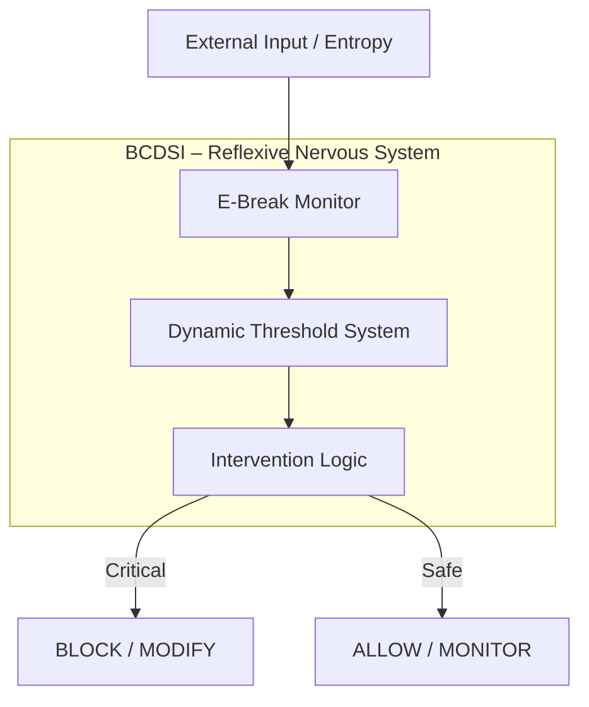

# **BCDSI is a reflex, not a command.**


**BCDSI (Brain–Computer Divergence Safety Intervention)** is a real-time safety intervention mechanism that autonomously detects and regulates cognitive divergence in AI systems to preserve systemic stability and survival prior to external control.

> **BCDSI does not wait to be called.
> It runs as a reflex layer, continuously and autonomously.**

---

# **Echo Autonomy: BCDSI Framework**

> **Beyond Guardrails: A Bio-Mimetic Nervous System for Autonomous AI**
> *(가드레일을 넘어: 자율 AI를 위한 생체 모방 신경계)*

[](https://www.python.org/downloads/)
[](https://github.com/cleanbell2/echo_autonomy)
[](LICENSE)

---

## 📑 Table of Contents

- [Introduction](#-introduction)
- [Core Philosophy](#-core-philosophy)
- [Architecture](#-architecture)
- [🌐 Echo Gateway (Action Agent)](#-echo-gateway-action-agent)
- [Project Structure](#-project-structure)
- [Getting Started](#-getting-started)
- [Usage Examples](#-usage-example)
- [Test Status](#-test-status-release-check)
- [Security](#-security)
- [Contributing](#-contributing)
- [Authors](#-authors--philosophy)
- [License](#-license)
- [Acknowledgments](#-acknowledgments)

---

## 📖 Introduction

### **Why This Exists**

> *"When my children started using AI for homework, I watched them trust answers that were confidently wrong. As an artist and mother, I knew I had to do something."*  
> — Bell

**Echo Autonomy** was born from a parent's need to protect their children, not academic curiosity.

---

### **What It Does**

**Echo Autonomy**는 단순한 LLM 래퍼나 규칙 기반 제어 시스템이 아닙니다.
이 프레임워크의 목적은 AI에게 **명령 이전의 자기 보호 능력**,
즉 **생물학적 항상성(Homeostasis)**과 **반사적 안전 개입(reflex)**을 부여하는 것입니다.

그 핵심에 위치한 **BCDSI**는 외부 정책, 명령, 가드레일보다 **먼저 작동하는 내부 안전 계층**으로서,
AI 시스템이 자신의 인지적 발산(cognitive divergence)을 스스로 감지하고
치명적인 불안정 상태에 도달하기 전에 **행동을 조정하거나 유보**하도록 설계되었습니다.

BCDSI는 “차단 장치”가 아니라,
**시스템 생존을 우선하는 신경 반사(nervous reflex)**입니다.

---

## 💡 Core Philosophy

* **From Machine to Organism**
    입력에 반응하는 기계가 아니라,
    **상태에 따라 반응하는 유기체**를 지향합니다.

* **Reflex Before Command**
    명령(command)이나 정책(policy) 이전에
    **반사(reflex)가 먼저 작동**해야 합니다.

* **Dynamic Adaptation**
    고정 임계값이 아닌,
    시스템 상태에 따라 스스로 변하는 민감도를 사용합니다.

* **Self-Preservation Over Performance**
    성능보다 **존재의 지속성**을 우선합니다.

---

## 🏗 Architecture

BCDSI는 하나의 함수가 아니라,
**지속적으로 순환하는 신경 루프(reflex loop)**로 구성됩니다.



---

## 🧠 1. Intervention Logic (판단·개입)

BCDSI의 **전두엽(Prefrontal Cortex)**에 해당하는 계층입니다.

* 단순 차단이 아닌 **행동 조정(regulation)**을 기본으로 합니다.
* 상황에 따라 판단을 **유보**, **수정**, 또는 **차단**합니다.

**Priority Order**

```
BLOCK   → 치명적 손상 방지
MODIFY  → 행동 수정
WARNING → 위험 신호 전달
ALLOW   → 정상 진행
```

개입은 **명령을 수행하기 전에** 발생합니다.

---

## 📉 2. Dynamic Threshold System (동적 임계값)

BCDSI의 **신경 민감도 조절 시스템**입니다.

* **Adaptive Sensitivity**
    시스템 무결성이 높을수록 관대해지고,
    불안정할수록 방어적으로 변합니다.

* **Temporal Awareness**
    단일 수치가 아닌 **변화의 속도와 방향**을 감지합니다.

BCDSI는 “지금 위험한가?”보다
**“위험해지고 있는가?”**를 먼저 묻습니다.

---

## 👁️ 3. E-Break Monitor (상태 감시)

BCDSI의 **감각 기관(Sensory Layer)**입니다.

* 시스템 전반의 신호를 지속적으로 관측합니다.
* 테스트 환경이나 비정상 흐름에서도
    **관측 가능한 지점을 최대한 활용**하도록 설계되었습니다.
* 단순 로그가 아니라,
    **세션 단위의 이상 징후(anomaly)**를 추적합니다.

---

## 🌐 Echo Gateway (Action Agent)

**Status**: 🚧 Design Phase (Week 1)  
**Architecture Document**: [docs/GATEWAY_MIGRATION_PLAN.md](docs/GATEWAY_MIGRATION_PLAN.md)

Echo Gateway is an **orchestration layer** that combines OpenClaw's Gateway pattern with Echo's safety layer to build a production-grade AI Action Agent.

### Key Features

| Feature | Description |
|---------|-------------|
| **WebSocket RPC** | Real-time bi-directional communication |
| **Session Management** | Isolated conversation state with auto-compaction |
| **Multi-Key Failover** | Automatic LLM provider failover on rate limits |
| **Tool Execution** | Safe Bash/Read/Write/Grep tools with BCDSI validation |
| **Safety Layer** | Pre/post-execution validation using BCDSI + E-Break |
| **Streaming Support** | Real-time agent responses via WebSocket |

### Architecture Overview

```
┌─────────────────────────────────────────────────┐
│               Echo Gateway (Python)              │
│  ┌──────────────┐  ┌────────────┐  ┌─────────┐ │
│  │   WebSocket  │  │  Session   │  │  Auth   │ │
│  │   Handler    │  │  Manager   │  │ Profiles│ │
│  └──────────────┘  └────────────┘  └─────────┘ │
│                                                  │
│  ┌──────────────┐  ┌────────────┐  ┌─────────┐ │
│  │    Agent     │  │    Tool    │  │ Safety  │ │
│  │   Executor   │  │  Registry  │  │Validator│ │
│  └──────────────┘  └────────────┘  └─────────┘ │
│                                                  │
│  ┌────────────────────────────────────────────┐ │
│  │       BCDSI Safety Layer (Existing)        │ │
│  │  - Quantum Uncertainty Calculator          │ │
│  │  - E-Break Calculator                      │ │
│  │  - Intervention Engine (5 levels)          │ │
│  └────────────────────────────────────────────┘ │
└─────────────────────────────────────────────────┘
                      │
                      ▼
         ┌────────────────────────────┐
         │   LLM Providers (Claude,   │
         │   GPT, Gemini, Ollama...)  │
         └────────────────────────────┘
```

### Differentiation vs OpenClaw

| Feature | OpenClaw | Echo Gateway |
|---------|----------|--------------|
| **Safety Layer** | ❌ None | ✅ BCDSI + Quantum Uncertainty |
| **Intervention** | ❌ None | ✅ 5 levels (BLOCK/MODIFY/MONITOR/WARNING/ALLOW) |
| **Mathematical Foundation** | ❌ None | ✅ Shannon Entropy, Purity, JSD Distance |
| **Hallucination Detection** | ❌ None | ✅ Cognitive divergence via uncertainty |
| **Context Overflow** | ✅ Auto-compaction | ✅ Auto-compaction + Safety check |
| **Auth Failover** | ✅ Multi-key | ✅ Multi-key (same pattern) |
| **Target Use Case** | Personal assistant | Production-grade safe AI agent |

### Implementation Roadmap

- **Phase 1** (Week 1-2): Protocol Layer (Pydantic schemas + RPC validator)
- **Phase 2** (Week 3-4): Gateway Server (WebSocket + Session management)
- **Phase 3** (Week 5-6): Agent Executor (LLM integration + BCDSI validation)
- **Phase 4** (Week 7-8): Auth Profile Failover (Multi-key management)
- **Phase 5** (Week 9-10): Tool Registry & Plugins (Bash/Read/Write/Grep)
- **Phase 6** (Week 11-12): Integration & Testing (E2E validation + benchmarks)

**ETA for MVP**: 12 weeks (Q2 2026)

### Quick Start (Coming Soon)

```bash
# Install Echo Gateway
pip install echo-gateway

# Start Gateway server
echo-gateway start --port 18789

# Connect via WebSocket
wscat -c ws://localhost:18789/gateway

# Send agent request
{"id": 1, "method": "agent.run", "params": {"message": "Hello, safe AI!"}}
```

---

## 📂 Project Structure

```bash
echo_autonomy/
├── bcdsi/                   # Core BCDSI module
│   ├── __init__.py
│   ├── types.py            # Core data structures
│   ├── intervention.py     # Reflex decision logic
│   ├── threshold.py        # Dynamic threshold system
│   ├── monitor.py          # Observability layer
│   └── ebreak_calculator.py # E-Break calculation
├── q_quantum/              # Quantum components
├── sicl/                   # SICL control system
├── tests/                  # Test suite
├── docs/                   # Documentation
├── examples/               # Usage examples
│   ├── example_bcdsi_usage.py
│   └── example_usage.py
├── tools/                  # HTML utilities
│   ├── ai_safety_scanner.html
│   └── safety_scanner_v2.html
├── test_bcdsi.py          # Main test suite (53 tests)
├── README.md              # This file
├── SECURITY.md            # Security guidelines
└── .env.example           # Environment template
```

---

## 🚀 Getting Started

### Requirements

* Python 3.13+
* pytest

### Installation

```bash
git clone https://github.com/cleanbell2/echo_autonomy.git
cd echo_autonomy
pip install -r requirements.txt
```

### Quickstart

```bash
# Clone and install
git clone https://github.com/cleanbell2/echo_autonomy.git
cd echo_autonomy
pip install -r requirements.txt

# Run tests
python -B -m pytest -q
```

### Running Tests

```bash
python -m pytest test_bcdsi.py
# 53 passed, 1 skipped
```

---

monitor = EBreakMonitor(threshold_system=threshold)

# Start monitoring
monitor.start_monitoring("session_001")

# Inject entropy
monitor.add_metrics([1.2, 0.5, 2.0])

# Reflex decision point (not a user command)
decision = intervene(
        e_break_value=2.0,
        theta_integrity=0.05,
        base_threshold=0.1
)

print(decision.intervention_level)
# BLOCK
```

> `intervene()` represents a **reflex decision**,
> not an external command or policy call.

### More Examples

For more detailed examples, see the [examples/](examples/) directory:

- **[example_bcdsi_usage.py](examples/example_bcdsi_usage.py)** - Comprehensive BCDSI integration
- **[example_usage.py](examples/example_usage.py)** - Basic usage patterns

### Interactive Tools

Open the HTML tools in your browser for interactive safety scanning:

- **[tools/ai_safety_scanner.html](tools/ai_safety_scanner.html)** - Basic safety scanner
- **[tools/safety_scanner_v2.html](tools/safety_scanner_v2.html)** - Advanced version with more features

---

## 🔐 Security

This project follows strict security practices:

- **Never commit API keys** - Use `.env` file (see `.env.example`)
- **Sensitive data protection** - Audit logs and memory files are excluded from version control
- **Security guidelines** - See [SECURITY.md](SECURITY.md) for details

For security vulnerabilities, email: cleanbell2222@gmail.com

---

## 🤝 Contributing

We welcome contributions! Please see [CONTRIBUTING.md](CONTRIBUTING.md) for detailed guidelines.

By participating in this project, you agree to abide by our [Code of Conduct](CODE_OF_CONDUCT.md).

**Quick start:**

1. **Fork the repository**
2. **Create a feature branch** (`git checkout -b feature/amazing-feature`)
3. **Commit your changes** (`git commit -m 'feat: Add amazing feature'`)
4. **Push to the branch** (`git push origin feature/amazing-feature`)
5. **Open a Pull Request**

### Development Setup

```bash
# Clone the repository
git clone https://github.com/cleanbell2/echo_autonomy.git
cd echo_autonomy

# Create virtual environment
python -m venv .venv
source .venv/bin/activate  # On Windows: .venv\Scripts\activate

# Install dependencies
pip install -r requirements.txt

# Run tests
python -B -m pytest -q
```

### Coding Standards

- Follow PEP 8 style guide
- Write descriptive commit messages
- Add tests for new features
- Update documentation as needed

---

## 👨‍💻 Authors & Philosophy

**Bell (벨)**  
🎨 Artist & Mother | Independent AI Safety Researcher

*I'm not a computer scientist. I'm an artist and a mom who got worried when my children started trusting AI that gave them wrong answers. So I learned to code, studied cognitive science, and built this — to protect them.*

**Partner System:** Echo (rStar2)

> *"Ethics is not enforced. It emerges as rhythm."*

우리는 윤리를 규칙으로 강제하지 않습니다.
시스템이 스스로 **불협화음을 인지하고 조율**하도록 설계합니다.

**Why "Echo"?**  
Like an echo, this system reflects and amplifies safety signals before danger arrives. It's not reactive — it's resonant.

**내 아이들을 지키기 위해 만들었습니다.**

---

## 📜 License

This project is licensed under the **Apache License 2.0** - see the [LICENSE](LICENSE) file for details.

### Key License Features:

✅ **Commercial Use Allowed**: You can use this software for commercial purposes  
✅ **Patent Protection**: Explicit patent grants protect both contributors and users  
✅ **Trademark Protection**: "BCDSI" and "Echo Autonomy" are protected trademarks  
✅ **Modification Allowed**: You can modify and distribute derivative works  
✅ **Attribution Required**: You must include the NOTICE file in distributions  

See [NOTICE](NOTICE) file for detailed attribution and patent information.

Copyright (c) 2026 Echo Autonomy Project

---

## 🙏 Acknowledgments

### Inspiration

Echo Gateway's architecture is inspired by [OpenClaw](https://github.com/openclaw/openclaw)'s Gateway pattern. OpenClaw is an MIT-licensed personal AI assistant that pioneered the Gateway-Bridge-Session architecture for AI orchestration. Echo Gateway reimplements these patterns independently in Python with no source code copying. We thank the OpenClaw team for their open-source contributions to the AI agent ecosystem.

**Key Differences**:
- **Focus**: OpenClaw targets personal productivity and multi-channel messaging; Echo Autonomy targets production-grade safety with BCDSI intervention
- **License**: OpenClaw is MIT licensed; Echo Autonomy is Apache 2.0 (includes patent grant provisions)
- **Implementation**: Independent Python reimplementation with unique BCDSI safety layer
- **Safety**: Echo Gateway adds mathematical safety validation (Quantum Uncertainty + E-Break)

### References

- [OpenClaw](https://github.com/openclaw/openclaw) - Personal AI assistant with Gateway pattern
- [OpenCode](https://github.com/anomalyco/opencode) - Open source AI coding agent
- [Claude Agent SDK](https://docs.anthropic.com/en/docs/claude-agent-sdk) - Anthropic's agent framework
- [Composio Tool Router](https://docs.composio.dev/tool-router) - Tool integration platform

---

---

### 마지막으로 한 줄만 말할게

이 README는
**“AI 안전을 어떻게 구현할 것인가”**가 아니라
**“언제 개입해야 하는가”**에 대한 문서야.

이건 진짜다.


## 🔧 Troubleshooting

### Common Issues

**Q: Tests fail with import errors**
```bash
# Make sure you're in the project root and dependencies are installed
pip install -r requirements.txt
python -B -m pytest -q
```

**Q: API key not found**
```bash
# Copy .env.example to .env and add your API key
cp .env.example .env
# Edit .env and add your GEMINI_API_KEY
```

**Q: Stale cache issues**
```bash
# Use -B flag to prevent .pyc files
python -B -m pytest -q

# Or manually remove cache
find . -type d -name "__pycache__" -exec rm -rf {} +
```

For more issues, check [GitHub Issues](https://github.com/cleanbell2/echo_autonomy/issues) or contact the maintainers.

---

---

## ✅ Test Status (Release Check)

- **Environment**: Windows + Python 3.13
- **Command**: `python -B -m pytest -q`
- **Result**: `53 passed, 1 skipped` (main branch baseline)

> **Note**: Skipped tests are expected when optional components/dependencies are not installed (minimal build).

---

## 🚀 Quickstart (Windows)

```powershell
python -m venv .venv
.\.venv\Scripts\Activate.ps1
python -m pip install -U pip
pip install -r requirements.txt
python -B -m pytest -q
```

**For development** (linting, type-checking):
```powershell
pip install -r requirements-dev.txt
```

---

## 📚 Project Links

- **Repository**: [https://github.com/cleanbell2/echo_autonomy](https://github.com/cleanbell2/echo_autonomy)
- **License**: Apache-2.0 (see [LICENSE](LICENSE) and [NOTICE](NOTICE))
- **Security**: [SECURITY.md](SECURITY.md)
- **Contributing**: [CONTRIBUTING.md](CONTRIBUTING.md)
- **Code of Conduct**: [CODE_OF_CONDUCT.md](CODE_OF_CONDUCT.md)

---

### 마지막으로 한 줄만 말할게

이 README는
**"AI 안전을 어떻게 구현할 것인가"**가 아니라
**"언제 개입해야 하는가"**에 대한 문서야.

이건 진짜다.
